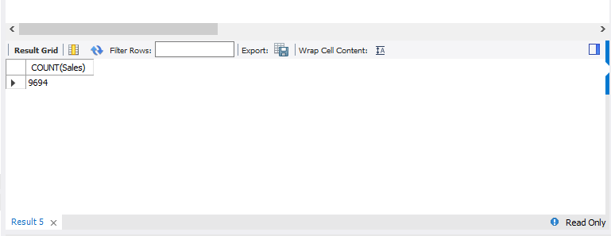
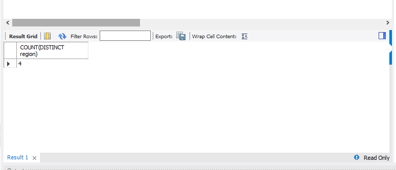
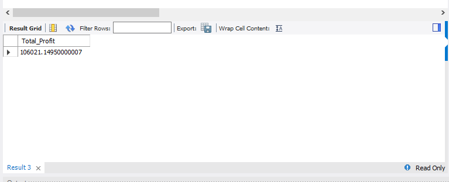

# Aggregate Functions

## Introduction:
One of the fundamental aspects of database management is the ability to effectively analyze and aggregate data within tables. This task serves as a guide to understanding the aggregate functions in SQL, including SUM, COUNT, AVERAGE, MIN, and MAX.

## Problem statement:

1. How many rows are in the SALES table provided?

2. The business is operating in how many regions?

3. What is the total profit generated in the WEST region?

4. What is the average profit generated from the sales of the company’s product?

5. On average, how many days does it take for a customer to get their orders shipped? Create a new column (Days_to_ship)

6. How many products does the company sell?

7. Show the names and cities of the 5 customers who contributed most to the overall profit.

8. Show the sales generated by cities where total sales  is greater than 20000

## Result/Discussion:

Number of rows in the sales column from the sample_superstore:

From the snapshot above, it shows the total number of rows in the SALES table and the syntax used is as follows;

SELECT COUNT(*) FROM SALES;

Total number of regions from the sample_superstore:

The snapshot above shows the number of regions in which the business is operating on and the command used is as folllows;

_SELECT COUNT(DISTINCT region) FROM superstore;_

Total profits generated in the West region:

The snapshot shows the total profits generated in the West region and the command used to acchieved this is as follows;

_Select Sum(profit) As Total_Profit from superstore_

_Where region = 'West';_

Average profit:

The snapshot above shows the average profit generated from the company's product sales and the command used is as follows;

_SELECT AVG(profit) AS Average_profit FROM superstore;_

Average number of days
